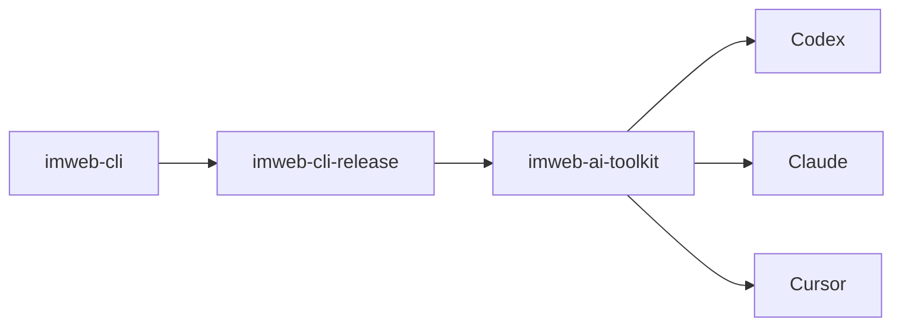

# imweb-ai-toolkit

[English](README.md) | [한국어](README.ko.md) | [中文](README.zh-CN.md)

`imweb-ai-toolkit` は `imweb` CLI を対応する AI coding surface に接続します。このリポジトリは skill asset、surface metadata、サンプル、install/bootstrap script を提供します。CLI バイナリと release payload は公開 `imweb-cli-release` 配布面から取得します。



## 含まれるもの

- Codex、Claude、Cursor、MCP reference wiring のための `plugin.json` と surface metadata
- `skills/imweb/`: `imweb` skill bundle と bundle-local docs
- `install/`: CLI と skill setup のための bootstrap/installer script
- `docs/`: 公開利用、統合、support matrix のドキュメント
- `examples/`: sample workflow と fixture

## インストール

対応 surface には bootstrap script を使用します。

```bash
./install/bootstrap-imweb.sh --tool codex --scope user
./install/bootstrap-imweb.sh --tool claude --scope user
```

PowerShell:

```powershell
./install/bootstrap-imweb.ps1 -Tool codex -Scope user
./install/bootstrap-imweb.ps1 -Tool claude -Scope user
```

Installer は既定で公開 `imweb-cli-release` stable channel を使用します。ローカルまたは固定バージョンのテストでは、[docs/skill-installation-and-usage.md](docs/skill-installation-and-usage.md) に記載されている release manifest file を渡してください。

## 最初に読むもの

1. [docs/skill-installation-and-usage.md](docs/skill-installation-and-usage.md)
2. [docs/cli-toolkit-integration.md](docs/cli-toolkit-integration.md)
3. [docs/surface-support-matrix.md](docs/surface-support-matrix.md)
4. [skills/imweb/SKILL.md](skills/imweb/SKILL.md)

## サポート範囲

Codex と Claude は automated bootstrap の主要対応 surface です。Cursor と Claude Cowork は限定的/手動接続 surface として文書化されています。正式な support detail は [docs/surface-support-matrix.md](docs/surface-support-matrix.md) を参照してください。

## ライセンス

このリポジトリの toolkit asset は [Apache-2.0](LICENSE) でライセンスされています。
Imweb の商標と brand asset は Apache-2.0 ではライセンスされません。詳細は [TRADEMARKS.md](TRADEMARKS.md) を参照してください。
