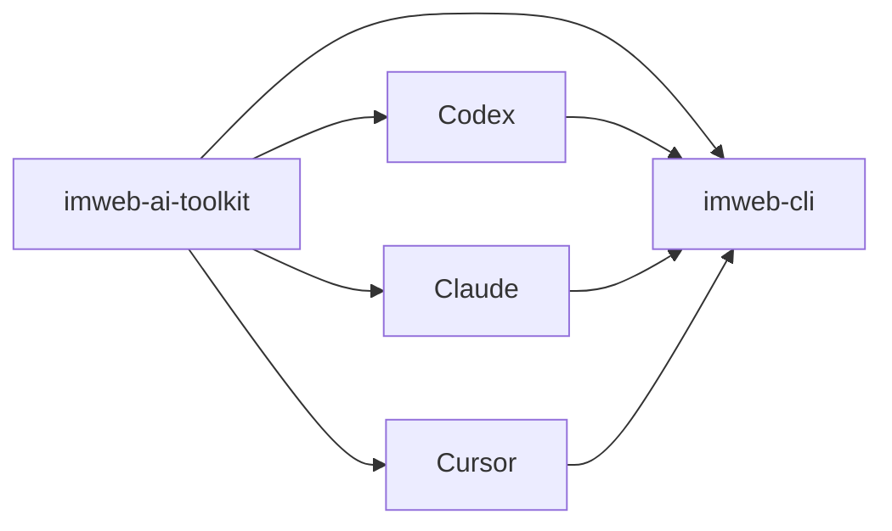

# imweb-ai-toolkit

[English](README.md) | [한국어](README.ko.md) | [中文](README.zh-CN.md)

`imweb-ai-toolkit` は `imweb` CLI をインストールし、対応する AI coding tool に接続します。このリポジトリは、ユーザーが CLI の配布構造を意識せずに始められるように、skill asset、surface metadata、サンプル、bootstrap script を提供します。



## 含まれるもの

- Codex、Claude、Cursor、MCP reference wiring のための `plugin.json`、marketplace metadata、surface metadata
- `skills/imweb/`: `imweb` skill bundle と bundle-local docs
- `install/`: CLI、skill、plugin setup のための bootstrap/installer script
- `docs/`: 公開利用、統合、support matrix のドキュメント
- `examples/`: sample workflow と fixture

## インストール

AI coding agent にインストールを任せる場合は、public `npx` installer を使用します。

```bash
npx --yes github:imwebme/imweb-ai-toolkit --tool both --scope user
```

このコマンドは public GitHub repository を永続的な marketplace source として登録し、Claude Code plugin をインストールし、Codex がすぐに discovery できるように `imweb` skill をコピーします。agent 向けのインストールと検証 checklist は [docs/ai-agent-installation.md](docs/ai-agent-installation.md) を参照してください。

対応 surface には bootstrap script を使用します。

```bash
./install/bootstrap-imweb.sh --tool codex --scope user
./install/bootstrap-imweb.sh --tool claude --scope user
```

PowerShell:

```powershell
./install/bootstrap-imweb.ps1 -Tool codex -Scope user
./install/bootstrap-imweb.ps1 -Tool claude -Scope user
```

Bootstrap script は必要に応じて `imweb` CLI をインストールまたは更新し、選択した tool に `imweb` skill をインストールします。高度なローカル設定や固定バージョンのテストは [docs/skill-installation-and-usage.md](docs/skill-installation-and-usage.md) を参照してください。

Plugin-first setup では toolkit plugin を登録またはインストールします。

```bash
./install/install-plugins.sh --tool codex
./install/install-plugins.sh --tool claude --scope user
./install/install-plugins.sh --package imweb-ai-toolkit-plugin.zip
```

PowerShell:

```powershell
./install/install-plugins.ps1 -Tool codex
./install/install-plugins.ps1 -Tool claude -Scope user
./install/install-plugins.ps1 -Package imweb-ai-toolkit-plugin.zip
```

Codex は marketplace 登録後に Plugins UI でインストールします。Claude Code は登録済み marketplace から直接インストールできます。Claude Desktop Cowork は生成した plugin zip をアップロードするか、組織 marketplace を使用できます。

## 最初に読むもの

1. [docs/ai-agent-installation.md](docs/ai-agent-installation.md)
2. [docs/skill-installation-and-usage.md](docs/skill-installation-and-usage.md)
3. [docs/cli-toolkit-integration.md](docs/cli-toolkit-integration.md)
4. [docs/surface-support-matrix.md](docs/surface-support-matrix.md)
5. [skills/imweb/SKILL.md](skills/imweb/SKILL.md)

## サポート範囲

Codex App/CLI、Claude Code、Claude Desktop Cowork は主要な plugin 対応 surface です。Cursor は限定的/手動接続 surface として文書化されています。正式な support detail は [docs/surface-support-matrix.md](docs/surface-support-matrix.md) を参照してください。

## ライセンス

このリポジトリの toolkit asset は [Apache-2.0](LICENSE) でライセンスされています。
Imweb の商標と brand asset は Apache-2.0 ではライセンスされません。詳細は [TRADEMARKS.md](TRADEMARKS.md) を参照してください。
