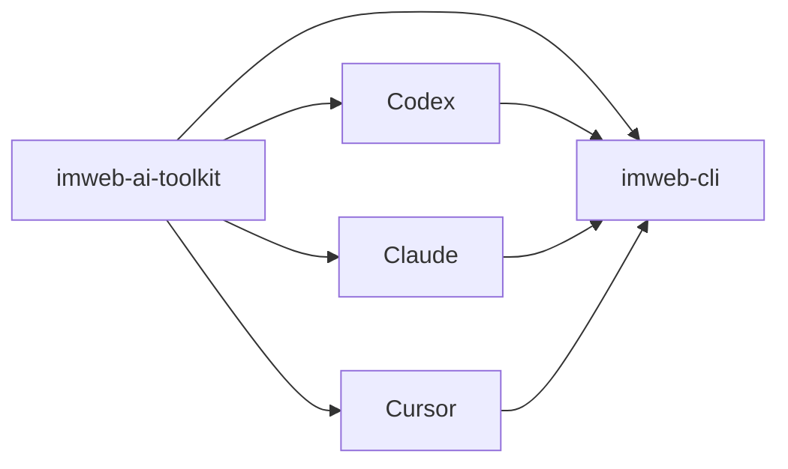

# imweb-ai-toolkit

[English](README.md) | [한국어](README.ko.md) | [中文](README.zh-CN.md)

`imweb-ai-toolkit` は `imweb` CLI をインストールし、対応する AI coding tool に接続します。このリポジトリは、ユーザーが CLI の配布構造を意識せずに始められるように、skill asset、surface metadata、サンプル、bootstrap script を提供します。



## 含まれるもの

- Codex、Claude、Cursor、MCP reference wiring のための `plugin.json`、marketplace metadata、surface metadata
- Claude Desktop Cowork がユーザーの host `imweb` CLI と auth state を再利用するための `bin/imweb-mcp.mjs` local MCP bridge
- `commands/imweb.md`: Claude plugin surface 向けの短い `/imweb` slash-command entrypoint
- `skills/imweb/`: `imweb` skill bundle と bundle-local docs
- `install/`: CLI、skill、plugin setup のための bootstrap/installer script
- `docs/`: 公開利用、統合、support matrix のドキュメント
- `examples/`: sample workflow と fixture

## インストール

- Claude Code では、Claude Code のチャットで次の 2 行を実行します。

```text
/plugin marketplace add imwebme/imweb-ai-toolkit
/plugin install imweb-ai-toolkit@imweb-ai-toolkit
```

- Codex では marketplace を登録し、Plugins UI から `imweb-ai-toolkit` を追加します。

```bash
codex plugin marketplace add imwebme/imweb-ai-toolkit --ref main
```

- Claude Desktop Cowork では、Cowork task 内で Claude に次の依頼を送ります。

```text
Install imweb AI toolkit:
npx -y github:imwebme/imweb-ai-toolkit --tool claude-cowork
Present imweb-ai-toolkit.plugin and imweb.skill so I can save them.
```

- AI coding agent に Codex と Claude Code のローカルセットアップを任せる場合は、次の 1 行を使います。

```bash
npx -y github:imwebme/imweb-ai-toolkit --tool both
```

Cowork コマンドは `imweb-ai-toolkit.plugin` と `imweb.skill` を作成します。提示された plugin/skill card を承認してから `/imweb 주문목록을 확인해줘` でテストします。Plugin には短い `/imweb` slash entrypoint と host CLI/auth を使う local MCP bridge が含まれます。Host CLI のログインが必要な場合は Claude がブラウザログインフローを開始でき、ユーザーはブラウザでログインを完了するだけで、Claude が auth を再確認して元の依頼を続行します。Skill package は同じ imweb 手順を custom Skill fallback として提供します。

## その他のインストール方法

`imweb` CLI binary だけがない場合は、次を実行します。

```bash
npx -y github:imwebme/imweb-ai-toolkit --tool cli
```

対象ツールが plugin をサポートしない場合は、標準 Agent Skill を直接インストールします。

```bash
npx skills add imwebme/imweb-ai-toolkit --skill imweb --copy -y --agent claude-code codex
```

すべての installer flag、検証手順、manual clone fallback は [docs/ai-agent-installation.md](docs/ai-agent-installation.md) を参照してください。高度なローカル設定や固定バージョンのテストは [docs/skill-installation-and-usage.md](docs/skill-installation-and-usage.md) を参照してください。

## 最初に読むもの

1. [docs/ai-agent-installation.md](docs/ai-agent-installation.md)
2. [docs/cowork-ask-claude-install.md](docs/cowork-ask-claude-install.md)
3. [docs/skill-installation-and-usage.md](docs/skill-installation-and-usage.md)
4. [docs/cli-toolkit-integration.md](docs/cli-toolkit-integration.md)
5. [docs/surface-support-matrix.md](docs/surface-support-matrix.md)
6. [skills/imweb/SKILL.md](skills/imweb/SKILL.md)

## サポート範囲

Codex App/CLI、Claude Code、Claude Desktop Cowork は主要な plugin 対応 surface です。Cursor は限定的/手動接続 surface として文書化されています。正式な support detail は [docs/surface-support-matrix.md](docs/surface-support-matrix.md) を参照してください。

## ライセンス

このリポジトリの toolkit asset は [Apache-2.0](LICENSE) でライセンスされています。
Imweb の商標と brand asset は Apache-2.0 ではライセンスされません。詳細は [TRADEMARKS.md](TRADEMARKS.md) を参照してください。
