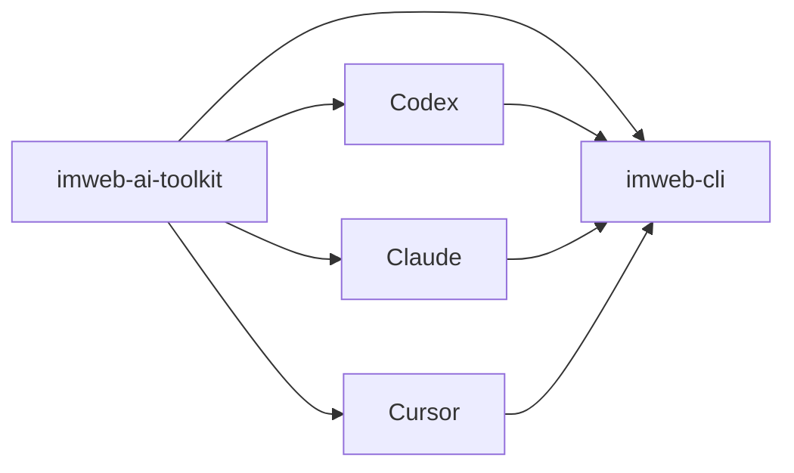

# imweb-ai-toolkit

[English](README.md) | [日本語](README.ja.md) | [中文](README.zh-CN.md)

`imweb-ai-toolkit`은 `imweb` CLI를 설치하고 지원되는 AI coding tool에 연결합니다. 이 저장소는 사용자가 CLI 배포 구조를 알 필요 없이 시작할 수 있도록 skill asset, surface metadata, 예시, bootstrap script를 제공합니다.



## 포함 내용

- Codex, Claude, Cursor, MCP reference wiring을 위한 `plugin.json`, marketplace metadata, surface metadata
- `skills/imweb/`: `imweb` skill bundle과 bundle-local docs
- `commands/imweb.md`: imweb workflow용 Claude plugin command entrypoint
- `install/`: CLI, skill, plugin setup용 bootstrap/installer script
- `docs/`: 공개 사용법, 통합, support matrix 문서
- `examples/`: sample workflow와 fixture

## 설치

- Claude Code에서는 Claude Code 채팅에 아래 두 줄을 실행합니다.

```text
/plugin marketplace add imwebme/imweb-ai-toolkit
/plugin install imweb-ai-toolkit@imweb-ai-toolkit
```

- Codex에서는 marketplace를 등록한 뒤 Plugins UI에서 `imweb-ai-toolkit`을 추가합니다.

```bash
codex plugin marketplace add imwebme/imweb-ai-toolkit --ref main
```

- Claude Desktop Cowork에서는 Cowork task 안에서 Claude에게 아래 요청을 보냅니다.

```text
Set up imweb AI toolkit for this Cowork task:
npx -y github:imwebme/imweb-ai-toolkit --tool claude-cowork
Present imweb-ai-toolkit.plugin so I can save it.
```

- AI coding agent에게 Codex와 Claude Code 로컬 설치를 맡길 때는 아래 한 줄을 사용합니다.

```bash
npx -y github:imwebme/imweb-ai-toolkit --tool both
```

Cowork 명령은 `imweb-ai-toolkit.plugin`과 fallback `imweb-skill.zip`을 생성합니다. 제시된 plugin card를 저장한 뒤 `/imweb`로 시작합니다. zip은 fallback package로만 사용합니다.

## 기타 설치 경로

대상 도구가 plugin을 지원하지 않으면 표준 Agent Skill을 직접 설치합니다.

```bash
npx skills add imwebme/imweb-ai-toolkit --skill imweb --copy -y --agent claude-code codex
```

전체 installer flag, 검증 절차, manual clone fallback은 [docs/ai-agent-installation.md](docs/ai-agent-installation.md)를 봅니다. 고급 로컬 설치나 고정 버전 테스트는 [docs/skill-installation-and-usage.md](docs/skill-installation-and-usage.md)를 봅니다.

## 먼저 볼 문서

1. [docs/ai-agent-installation.md](docs/ai-agent-installation.md)
2. [docs/cowork-ask-claude-install.md](docs/cowork-ask-claude-install.md)
3. [docs/skill-installation-and-usage.md](docs/skill-installation-and-usage.md)
4. [docs/cli-toolkit-integration.md](docs/cli-toolkit-integration.md)
5. [docs/surface-support-matrix.md](docs/surface-support-matrix.md)
6. [skills/imweb/SKILL.md](skills/imweb/SKILL.md)

## 지원 범위

Codex App/CLI, Claude Code, Claude Desktop Cowork는 기본 plugin 지원 surface입니다. Cursor는 제한적/수동 연결 surface로 문서화합니다. authoritative support detail은 [docs/surface-support-matrix.md](docs/surface-support-matrix.md)를 봅니다.

## 라이선스

이 저장소의 toolkit asset은 [Apache-2.0](LICENSE)으로 배포됩니다.
Imweb 상표와 brand asset은 Apache-2.0으로 라이선스되지 않습니다. 자세한 내용은 [TRADEMARKS.md](TRADEMARKS.md)를 봅니다.
