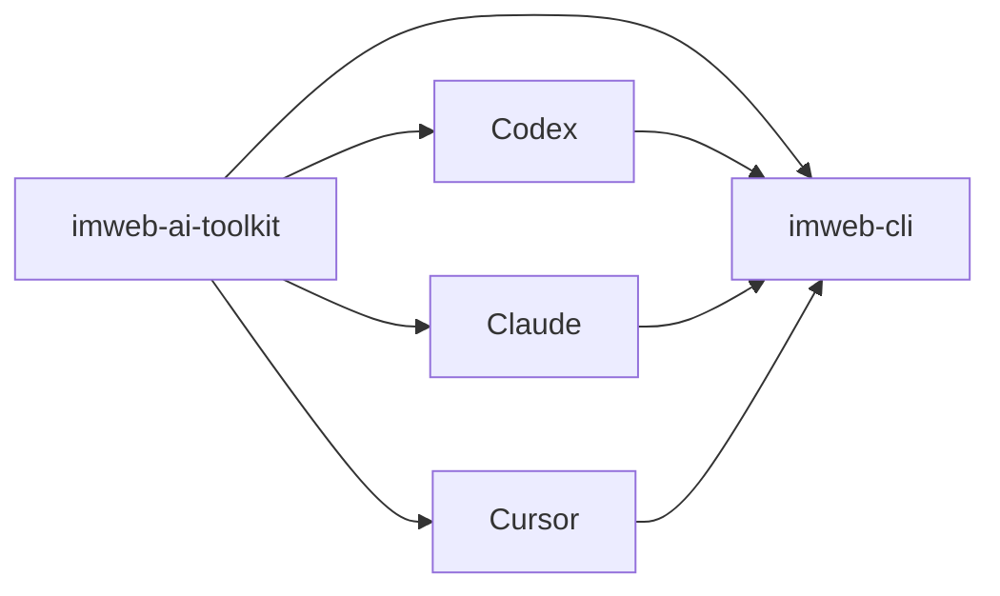

# imweb-ai-toolkit

[English](README.md) | [日本語](README.ja.md) | [中文](README.zh-CN.md)

`imweb-ai-toolkit`은 `imweb` CLI를 설치하고 지원되는 AI coding tool에 연결합니다. 이 저장소는 사용자가 CLI 배포 구조를 알 필요 없이 시작할 수 있도록 skill asset, surface metadata, 예시, bootstrap script를 제공합니다.



## 포함 내용

- Codex, Claude, Cursor, MCP reference wiring을 위한 `plugin.json`과 surface metadata
- `skills/imweb/`: `imweb` skill bundle과 bundle-local docs
- `install/`: CLI 및 skill setup용 bootstrap/installer script
- `docs/`: 공개 사용법, 통합, support matrix 문서
- `examples/`: sample workflow와 fixture

## 설치

지원 surface에는 bootstrap script를 사용합니다.

```bash
./install/bootstrap-imweb.sh --tool codex --scope user
./install/bootstrap-imweb.sh --tool claude --scope user
```

PowerShell:

```powershell
./install/bootstrap-imweb.ps1 -Tool codex -Scope user
./install/bootstrap-imweb.ps1 -Tool claude -Scope user
```

Bootstrap script는 필요하면 `imweb` CLI를 설치하거나 업데이트한 뒤, 선택한 tool에 `imweb` skill을 설치합니다. 고급 로컬 설치나 고정 버전 테스트는 [docs/skill-installation-and-usage.md](docs/skill-installation-and-usage.md)를 봅니다.

## 먼저 볼 문서

1. [docs/skill-installation-and-usage.md](docs/skill-installation-and-usage.md)
2. [docs/cli-toolkit-integration.md](docs/cli-toolkit-integration.md)
3. [docs/surface-support-matrix.md](docs/surface-support-matrix.md)
4. [skills/imweb/SKILL.md](skills/imweb/SKILL.md)

## 지원 범위

Codex와 Claude는 automated bootstrap의 기본 지원 surface입니다. Cursor와 Claude Cowork는 제한적/수동 연결 surface로 문서화합니다. authoritative support detail은 [docs/surface-support-matrix.md](docs/surface-support-matrix.md)를 봅니다.

## 라이선스

이 저장소의 toolkit asset은 [Apache-2.0](LICENSE)으로 배포됩니다.
Imweb 상표와 brand asset은 Apache-2.0으로 라이선스되지 않습니다. 자세한 내용은 [TRADEMARKS.md](TRADEMARKS.md)를 봅니다.
