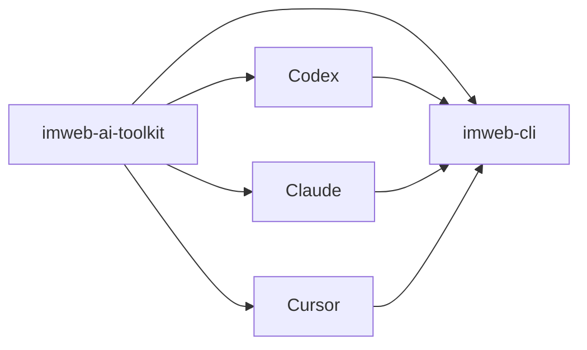

# imweb-ai-toolkit

[영어](README.md) | [일본어](README.ja.md) | [중국어](README.zh-CN.md)

`imweb-ai-toolkit`은 `imweb` CLI를 설치하고 지원되는 AI coding tool에 연결합니다. 이 저장소는 사용자가 CLI 배포 구조를 알 필요 없이 시작할 수 있도록 skill asset, surface metadata, 예시, bootstrap script를 제공합니다.



## 포함 내용

- Codex, Claude, Cursor, MCP reference wiring을 위한 `plugin.json`, marketplace metadata, surface metadata
- Claude Desktop Cowork가 사용자 컴퓨터의 host `imweb` CLI와 auth 상태를 재사용하게 하는 `bin/imweb-mcp.mjs` local MCP bridge
- `commands/imweb.md`: Claude plugin 표면의 짧은 `/imweb` slash-command 진입점
- `skills/imweb/`: `imweb` skill bundle과 bundle-local docs
- `install/`: CLI, skill, plugin setup용 bootstrap/installer script
- `docs/`: 공개 사용법, 통합, support matrix 문서
- `examples/`: sample workflow와 fixture

## 설치

- Claude Code에서는 Claude Code 채팅에 아래 두 줄을 실행합니다.

```text
/plugin marketplace add imwebme/imweb-ai-toolkit
/plugin install imweb-ai-toolkit@imweb-ai-toolkit
```

- Codex에서는 marketplace를 등록한 뒤 Plugins UI에서 `imweb-ai-toolkit`을 추가합니다.

```bash
codex plugin marketplace add imwebme/imweb-ai-toolkit --ref main
```

- Claude Desktop Cowork에서는 Cowork task 안에서 Claude에게 아래 요청을 보냅니다.

```text
아임웹 도구 패키지를 설치해줘:
npx -y github:imwebme/imweb-ai-toolkit --tool claude-cowork
imweb-ai-toolkit.plugin과 imweb.skill을 저장할 수 있게 보여줘.
```

- Claude Desktop chat local MCP에서는 one-click MCPB bundle을 만듭니다.

```bash
npx -y github:imwebme/imweb-ai-toolkit --tool claude-desktop
```

- AI coding agent에게 Codex와 Claude Code 로컬 설치를 맡길 때는 아래 한 줄을 사용합니다.

```bash
npx -y github:imwebme/imweb-ai-toolkit --tool both
```

설치 후 동작은 다음과 같습니다.

- 로컬 plugin installer는 기본적으로 공식 `imweb` CLI를 설치하거나 업데이트합니다.
- `--tool claude-desktop`은 Claude Desktop local MCP bundle인 `imweb-ai-toolkit.mcpb`를 만듭니다. Claude Desktop으로 열고 Install을 클릭하면 bundle 안의 MCP bridge가 첫 사용 시 CLI 설치/업데이트를 관리합니다.
- `--tool claude-cowork`는 `imweb-ai-toolkit.plugin`과 `imweb.skill`을 생성합니다. 제시된 plugin/skill card를 수락한 뒤 아래처럼 자연어 업무 문장으로 시작합니다.

```text
아임웹툴로 최근 주문 중 이상 거래를 조사해줘.
```

```text
아임웹도구로 방문자가 많은 상품 상위 5개를 가져와서 가능한 범위까지 상세페이지를 점검해줘.
```

- 사용자는 `아임웹도구`, `아임웹 도구`, `아임웹툴`처럼 짧게 불러도 같은 imweb 진입점으로 들어갈 수 있습니다.
- 현재 Claude Desktop Cowork build는 skill이 활성화되어 있어도 task 시작 전에 `/imweb` 같은 slash-form text를 거절할 수 있습니다. 이 경우 자연어 요청을 사용합니다.
- Plugin에는 Claude plugin surface용 `/imweb` slash 진입점과 해당 도구를 노출하는 host용 local `imweb-cli` MCP bridge가 포함됩니다.
- Claude Desktop이 imweb tool 권한을 물으면 `이 작업에 허용`을 누릅니다.
- Host CLI 로그인이 필요하면 Claude가 브라우저 로그인 플로우를 시작할 수 있습니다. 사용자는 브라우저에서 imweb 로그인만 완료하면 되고, Claude가 auth를 다시 확인한 뒤 원래 요청을 이어갑니다.
- 방문자/트래픽 기준 상품 순위처럼 요청한 지표가 CLI에 없으면 Claude가 한계를 설명하고 상품 목록, 상품 상세, 리뷰, 사이트 정보, 최근 주문 같은 가능한 read-only 점검으로 이어갑니다.
- Skill package는 같은 imweb 지침을 custom Skill fallback으로 제공합니다.

## 기타 설치 경로

`imweb` CLI binary만 없으면 아래처럼 설치합니다.

```bash
npx -y github:imwebme/imweb-ai-toolkit --tool cli
```

대상 도구가 plugin을 지원하지 않으면 표준 Agent Skill을 직접 설치합니다.

```bash
npx skills add imwebme/imweb-ai-toolkit --skill imweb --copy -y --agent claude-code codex
```

전체 installer flag, 검증 절차, manual clone fallback은 [docs/ai-agent-installation.md](docs/ai-agent-installation.md)를 봅니다. 고급 로컬 설치나 고정 버전 테스트는 [docs/skill-installation-and-usage.md](docs/skill-installation-and-usage.md)를 봅니다.

## 삭제

Codex와 Claude Code 로컬 설정을 제거하려면 아래 명령을 사용합니다.

```bash
npx -y github:imwebme/imweb-ai-toolkit --uninstall --tool both
```

생성된 로컬 package artifact와 installer가 관리하는 CLI까지 모두 정리하려면 아래 명령을 사용합니다.

```bash
npx -y github:imwebme/imweb-ai-toolkit --uninstall --tool all
```

삭제는 toolkit plugin, marketplace, 복사된 skill, toolkit이 소유한 plugin cache/data/log, 생성된 `.plugin`/`.skill`/`.mcpb` artifact를 제거합니다. CLI는 installer가 관리하는 위치에 있을 때만 제거하며, imweb 로그인/auth 데이터는 유지합니다. `imweb` CLI를 남기려면 `--keep-cli`를 추가합니다.

## 먼저 볼 문서

1. [docs/ai-agent-installation.md](docs/ai-agent-installation.md)
2. [docs/cowork-ask-claude-install.md](docs/cowork-ask-claude-install.md)
3. [docs/skill-installation-and-usage.md](docs/skill-installation-and-usage.md)
4. [docs/cli-toolkit-integration.md](docs/cli-toolkit-integration.md)
5. [docs/surface-support-matrix.md](docs/surface-support-matrix.md)
6. [skills/imweb/SKILL.md](skills/imweb/SKILL.md)

## 지원 범위

Codex App/CLI, Claude Code, Claude Desktop Cowork는 기본 plugin 지원 surface입니다. Cursor는 제한적/수동 연결 surface로 문서화합니다. authoritative support detail은 [docs/surface-support-matrix.md](docs/surface-support-matrix.md)를 봅니다.

## 라이선스

이 저장소의 toolkit asset은 [Apache-2.0](LICENSE)으로 배포됩니다.
Imweb 상표와 brand asset은 Apache-2.0으로 라이선스되지 않습니다. 자세한 내용은 [TRADEMARKS.md](TRADEMARKS.md)를 봅니다.
