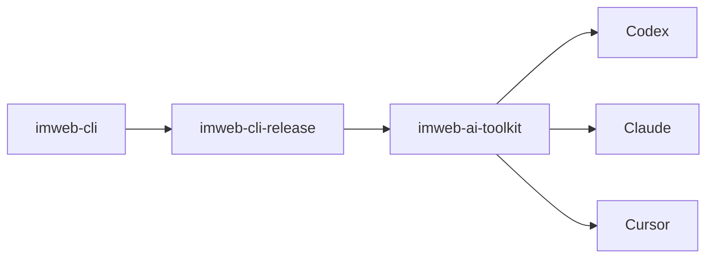

# imweb-ai-toolkit

[한국어](README.ko.md) | [日本語](README.ja.md) | [中文](README.zh-CN.md)

`imweb-ai-toolkit` connects the `imweb` CLI to supported AI coding surfaces. It provides skill assets, surface metadata, examples, and install/bootstrap scripts; the CLI binary and release payloads come from the public `imweb-cli-release` distribution plane.



## What This Repo Contains

- `plugin.json` and surface metadata for Codex, Claude, Cursor, and MCP reference wiring.
- `skills/imweb/`, the `imweb` skill bundle and its local docs.
- `install/`, bootstrap and installer scripts for CLI and skill setup.
- `docs/`, public usage, integration, and support matrix documentation.
- `examples/`, sample workflows and fixtures.

## Install

Use the bootstrap script for supported surfaces:

```bash
./install/bootstrap-imweb.sh --tool codex --scope user
./install/bootstrap-imweb.sh --tool claude --scope user
```

PowerShell:

```powershell
./install/bootstrap-imweb.ps1 -Tool codex -Scope user
./install/bootstrap-imweb.ps1 -Tool claude -Scope user
```

The installer defaults to the public `imweb-cli-release` stable channel. For local or pinned testing, pass a release manifest file as documented in [docs/skill-installation-and-usage.md](docs/skill-installation-and-usage.md).

## Start Here

1. [docs/skill-installation-and-usage.md](docs/skill-installation-and-usage.md)
2. [docs/cli-toolkit-integration.md](docs/cli-toolkit-integration.md)
3. [docs/surface-support-matrix.md](docs/surface-support-matrix.md)
4. [skills/imweb/SKILL.md](skills/imweb/SKILL.md)

## Support Scope

Codex and Claude are the primary supported surfaces for automated bootstrap. Cursor and Claude Cowork are documented as limited/manual connection surfaces. The authoritative support detail is [docs/surface-support-matrix.md](docs/surface-support-matrix.md).

## License

Toolkit assets in this repository are licensed under [Apache-2.0](LICENSE).
Imweb trademarks and brand assets are not licensed by Apache-2.0; see [TRADEMARKS.md](TRADEMARKS.md).
