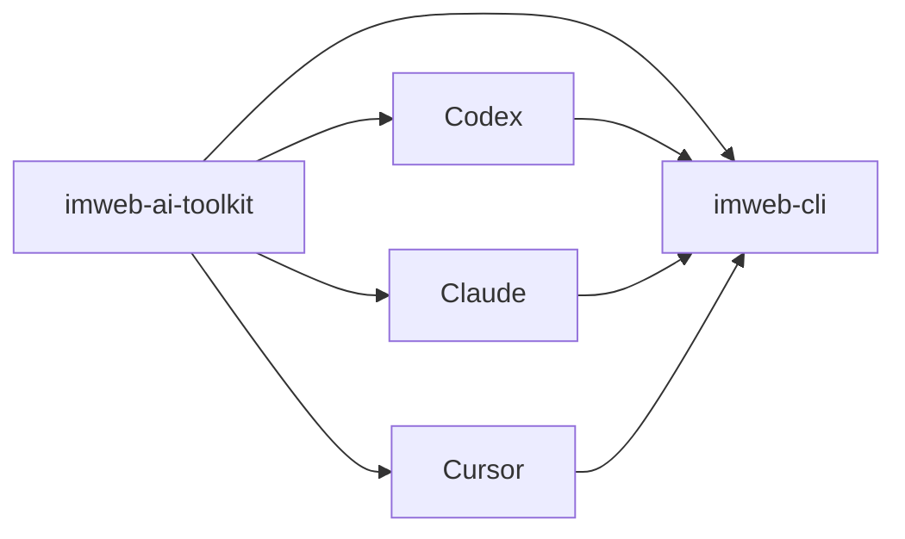

# imweb-ai-toolkit

[한국어](README.ko.md) | [日本語](README.ja.md) | [中文](README.zh-CN.md)

`imweb-ai-toolkit` installs the `imweb` CLI and connects it to supported AI coding tools. It provides the skill assets, surface metadata, examples, and bootstrap scripts needed to get started without requiring users to understand the release infrastructure behind the CLI.



## What This Repo Contains

- `plugin.json`, marketplace metadata, and surface metadata for Codex, Claude, Cursor, and MCP reference wiring.
- `bin/imweb-mcp.mjs`, a local MCP bridge for Claude Desktop Cowork that reuses the user's host `imweb` CLI and auth state.
- `commands/imweb.md`, the short `/imweb` slash-command entrypoint for Claude plugin surfaces.
- `skills/imweb/`, the `imweb` skill bundle and its local docs.
- `install/`, bootstrap and installer scripts for CLI, skill, and plugin setup.
- `docs/`, public usage, integration, and support matrix documentation.
- `examples/`, sample workflows and fixtures.

## Install

- For Claude Code, run these two commands in a Claude Code chat:

```text
/plugin marketplace add imwebme/imweb-ai-toolkit
/plugin install imweb-ai-toolkit@imweb-ai-toolkit
```

- For Codex, register the marketplace, then add `imweb-ai-toolkit` from the Plugins UI:

```bash
codex plugin marketplace add imwebme/imweb-ai-toolkit --ref main
```

- For Claude Desktop Cowork, ask Claude in the Cowork task:

```text
Install imweb AI toolkit:
npx -y github:imwebme/imweb-ai-toolkit --tool claude-cowork
Present imweb-ai-toolkit.plugin and imweb.skill so I can save them.
```

- For an AI coding agent installing Codex and Claude Code locally:

```bash
npx -y github:imwebme/imweb-ai-toolkit --tool both
```

The Cowork command creates `imweb-ai-toolkit.plugin` and `imweb.skill`. Accept the presented plugin and skill cards, then try `/imweb 주문목록을 확인해줘`. The plugin includes the `/imweb` slash entrypoint and a local `imweb-cli` MCP bridge so Cowork can call the host CLI without asking for Terminal or computer-use. The skill package keeps the same imweb instructions available as a custom Skill fallback.

## Other Install Methods

If only the `imweb` CLI binary is missing:

```bash
npx -y github:imwebme/imweb-ai-toolkit --tool cli
```

If the target tool does not support plugins, install the standard Agent Skill directly:

```bash
npx skills add imwebme/imweb-ai-toolkit --skill imweb --copy -y --agent claude-code codex
```

For full installer flags, verification steps, and manual clone fallback, see [docs/ai-agent-installation.md](docs/ai-agent-installation.md). Advanced local or pinned-version setup is documented in [docs/skill-installation-and-usage.md](docs/skill-installation-and-usage.md).

## Start Here

1. [docs/ai-agent-installation.md](docs/ai-agent-installation.md)
2. [docs/cowork-ask-claude-install.md](docs/cowork-ask-claude-install.md)
3. [docs/skill-installation-and-usage.md](docs/skill-installation-and-usage.md)
4. [docs/cli-toolkit-integration.md](docs/cli-toolkit-integration.md)
5. [docs/surface-support-matrix.md](docs/surface-support-matrix.md)
6. [skills/imweb/SKILL.md](skills/imweb/SKILL.md)

## Support Scope

Codex App/CLI, Claude Code, and Claude Desktop Cowork are the primary supported plugin surfaces. Cursor remains documented as a limited/manual connection surface. The authoritative support detail is [docs/surface-support-matrix.md](docs/surface-support-matrix.md).

## License

Toolkit assets in this repository are licensed under [Apache-2.0](LICENSE).
Imweb trademarks and brand assets are not licensed by Apache-2.0; see [TRADEMARKS.md](TRADEMARKS.md).
