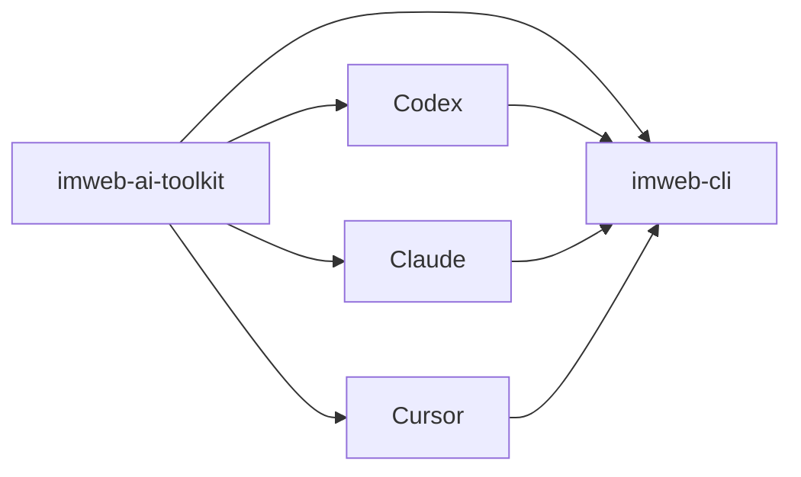

# imweb-ai-toolkit

[한국어](README.ko.md) | [日本語](README.ja.md) | [中文](README.zh-CN.md)

`imweb-ai-toolkit` installs the `imweb` CLI and connects it to supported AI coding tools. It provides the skill assets, surface metadata, examples, and bootstrap scripts needed to get started without requiring users to understand the release infrastructure behind the CLI.



## What This Repo Contains

- `plugin.json`, marketplace metadata, and surface metadata for Codex, Claude, Cursor, and MCP reference wiring.
- `skills/imweb/`, the `imweb` skill bundle and its local docs.
- `commands/imweb.md`, a Claude plugin command entrypoint for imweb workflows.
- `install/`, bootstrap and installer scripts for CLI, skill, and plugin setup.
- `docs/`, public usage, integration, and support matrix documentation.
- `examples/`, sample workflows and fixtures.

## Install

Recommended plugin setup:

```bash
claude plugin marketplace add imwebme/imweb-ai-toolkit --scope user
claude plugin install imweb-ai-toolkit@imweb-ai-toolkit --scope user
codex plugin marketplace add imwebme/imweb-ai-toolkit --ref main
```

Codex uses the Plugins UI after marketplace registration. For immediate Codex skill discovery, or when an AI coding agent is doing the setup for you, use the public `npx` installer:

```bash
npx --yes github:imwebme/imweb-ai-toolkit --tool both --scope user
```

Standard Agent Skills fallback:

```bash
npx skills add imwebme/imweb-ai-toolkit --skill imweb --copy -y --agent claude-code codex
```

For Claude Cowork, ask Claude to create and verify the packages, not to operate Claude Desktop:

```bash
npx --yes github:imwebme/imweb-ai-toolkit --tool claude-cowork
```

This creates `imweb-skill.zip` and `imweb-ai-toolkit-plugin.zip`. If the current Cowork task cannot load new Skills from task files, the verified zip files must be provisioned later by the user, workspace admin, or a supported Cowork Skill installation flow. See [docs/cowork-ask-claude-install.md](docs/cowork-ask-claude-install.md) for the exact no-UI prompt and [docs/ai-agent-installation.md](docs/ai-agent-installation.md) for the full checklist.

Use the bootstrap script for supported surfaces:

```bash
./install/bootstrap-imweb.sh --tool codex --scope user
./install/bootstrap-imweb.sh --tool claude --scope user
```

PowerShell:

```powershell
./install/bootstrap-imweb.ps1 -Tool codex -Scope user
./install/bootstrap-imweb.ps1 -Tool claude -Scope user
```

The bootstrap script installs or updates the `imweb` CLI as needed, then installs the `imweb` skill for the selected tool. Advanced local or pinned-version setup is documented in [docs/skill-installation-and-usage.md](docs/skill-installation-and-usage.md).

For plugin-first setup, register or install the toolkit plugin:

```bash
./install/install-plugins.sh --tool codex
./install/install-plugins.sh --tool claude --scope user
./install/install-plugins.sh --package imweb-ai-toolkit-plugin.zip
```

PowerShell:

```powershell
./install/install-plugins.ps1 -Tool codex
./install/install-plugins.ps1 -Tool claude -Scope user
./install/install-plugins.ps1 -Package imweb-ai-toolkit-plugin.zip
```

Codex uses the Plugins UI after marketplace registration. Claude Code can install directly from the registered marketplace and can verify the plugin skill with `/imweb-ai-toolkit:imweb`. Claude Cowork direct `/imweb` is provided by a provisioned custom Skill package; the generated plugin zip remains available for plugin UI or organization marketplace workflows.

## Start Here

1. [docs/ai-agent-installation.md](docs/ai-agent-installation.md)
2. [docs/cowork-ask-claude-install.md](docs/cowork-ask-claude-install.md)
3. [docs/skill-installation-and-usage.md](docs/skill-installation-and-usage.md)
4. [docs/cli-toolkit-integration.md](docs/cli-toolkit-integration.md)
5. [docs/surface-support-matrix.md](docs/surface-support-matrix.md)
6. [skills/imweb/SKILL.md](skills/imweb/SKILL.md)

## Support Scope

Codex App/CLI, Claude Code, and Claude Desktop Cowork are the primary supported plugin surfaces. Cursor remains documented as a limited/manual connection surface. The authoritative support detail is [docs/surface-support-matrix.md](docs/surface-support-matrix.md).

## License

Toolkit assets in this repository are licensed under [Apache-2.0](LICENSE).
Imweb trademarks and brand assets are not licensed by Apache-2.0; see [TRADEMARKS.md](TRADEMARKS.md).
