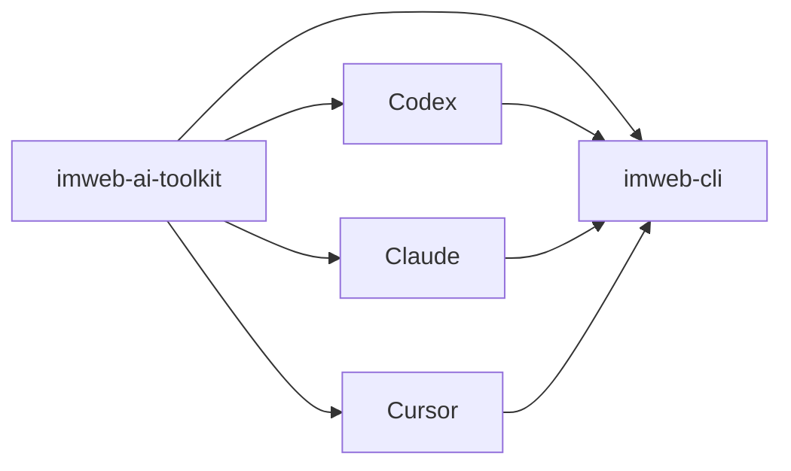

# imweb-ai-toolkit

[English](README.md) | [한국어](README.ko.md) | [日本語](README.ja.md)

`imweb-ai-toolkit` 会安装 `imweb` CLI，并将其连接到受支持的 AI coding tool。此仓库提供 skill asset、surface metadata、示例和 bootstrap script，让用户无需了解 CLI 背后的分发结构即可开始使用。



## 包含内容

- 用于 Codex、Claude、Cursor 和 MCP reference wiring 的 `plugin.json`、marketplace metadata 与 surface metadata
- `bin/imweb-mcp.mjs` local MCP bridge，让 Claude Desktop Cowork 复用用户电脑上的 host `imweb` CLI 和 auth state
- `commands/imweb.md`: Claude plugin surface 的简短 `/imweb` slash-command 入口
- `skills/imweb/`: `imweb` skill bundle 及其 bundle-local docs
- `install/`: 用于 CLI、skill 和 plugin setup 的 bootstrap/installer script
- `docs/`: 公开使用、集成和 support matrix 文档
- `examples/`: sample workflow 和 fixture

## 安装

- 在 Claude Code 中，在 Claude Code 聊天里运行这两行：

```text
/plugin marketplace add imwebme/imweb-ai-toolkit
/plugin install imweb-ai-toolkit@imweb-ai-toolkit
```

- 在 Codex 中，先注册 marketplace，然后从 Plugins UI 添加 `imweb-ai-toolkit`：

```bash
codex plugin marketplace add imwebme/imweb-ai-toolkit --ref main
```

- 在 Claude Desktop Cowork 中，在 Cowork task 里让 Claude 执行：

```text
Install imweb AI toolkit:
npx -y github:imwebme/imweb-ai-toolkit --tool claude-cowork
Present imweb-ai-toolkit.plugin and imweb.skill so I can save them.
```

- 在 Claude Desktop chat local MCP 中，创建 one-click MCPB bundle：

```bash
npx -y github:imwebme/imweb-ai-toolkit --tool claude-desktop
```

- 让 AI coding agent 为 Codex 和 Claude Code 执行本地安装时，使用这一行：

```bash
npx -y github:imwebme/imweb-ai-toolkit --tool both
```

安装后的行为如下：

- Local plugin installer 默认会安装或更新官方 `imweb` CLI。
- `--tool claude-desktop` 会创建 Claude Desktop local MCP bundle `imweb-ai-toolkit.mcpb`。用 Claude Desktop 打开并点击 Install 后，bundle 内的 MCP bridge 会在首次使用时管理 CLI 安装/更新。
- `--tool claude-cowork` 会生成 `imweb-ai-toolkit.plugin` 和 `imweb.skill`。接受展示出的 plugin/skill card 后，用下面这样的自然语言业务请求开始：

```text
최근 주문중 이상 거래 조사해줘. imweb AI Toolkit을 사용해줘.
```

```text
방문자 많은 상품 top 5 가져와서 상세페이지 점검해줘. imweb AI Toolkit으로 가능한 범위까지 확인해줘.
```

- 当前 Claude Desktop Cowork build 即使 skill 已启用，也可能在 task 开始前拒绝 `/imweb` 这样的 slash-form text；如果发生这种情况，请改用自然语言请求。
- Plugin 包含 Claude plugin surface 的 `/imweb` slash 入口，以及 host 暴露这些工具时可用的 local `imweb-cli` MCP bridge。
- 如果 Claude Desktop 请求 imweb tool 权限，请点击 `Allow for this task`。
- 若 host CLI 需要登录，Claude 可以启动浏览器登录流程。用户只需在浏览器中完成 imweb 登录，Claude 会重新检查 auth 并继续原始请求。
- 如果请求的指标不在 CLI 支持范围内，例如按访客/traffic 排名的商品，Claude 会说明限制，并继续执行商品列表、商品详情、评价、站点信息或最近订单等可用的 read-only 检查。
- Skill package 则把相同的 imweb 指南作为 custom Skill fallback 提供。

## 其他安装方式

如果只缺少 `imweb` CLI binary，请运行：

```bash
npx -y github:imwebme/imweb-ai-toolkit --tool cli
```

如果目标工具不支持 plugin，请直接安装标准 Agent Skill：

```bash
npx skills add imwebme/imweb-ai-toolkit --skill imweb --copy -y --agent claude-code codex
```

完整 installer flag、验证步骤和 manual clone fallback 见 [docs/ai-agent-installation.md](docs/ai-agent-installation.md)。高级本地设置或固定版本测试请参见 [docs/skill-installation-and-usage.md](docs/skill-installation-and-usage.md)。

## 从这里开始

1. [docs/ai-agent-installation.md](docs/ai-agent-installation.md)
2. [docs/cowork-ask-claude-install.md](docs/cowork-ask-claude-install.md)
3. [docs/skill-installation-and-usage.md](docs/skill-installation-and-usage.md)
4. [docs/cli-toolkit-integration.md](docs/cli-toolkit-integration.md)
5. [docs/surface-support-matrix.md](docs/surface-support-matrix.md)
6. [skills/imweb/SKILL.md](skills/imweb/SKILL.md)

## 支持范围

Codex App/CLI、Claude Code 和 Claude Desktop Cowork 是主要支持的 plugin surface。Cursor 被记录为有限/手动连接 surface。权威 support detail 请参见 [docs/surface-support-matrix.md](docs/surface-support-matrix.md)。

## 许可证

此仓库中的 toolkit asset 根据 [Apache-2.0](LICENSE) 授权。
Imweb 商标和 brand asset 不包含在 Apache-2.0 授权中；请参见 [TRADEMARKS.md](TRADEMARKS.md)。
