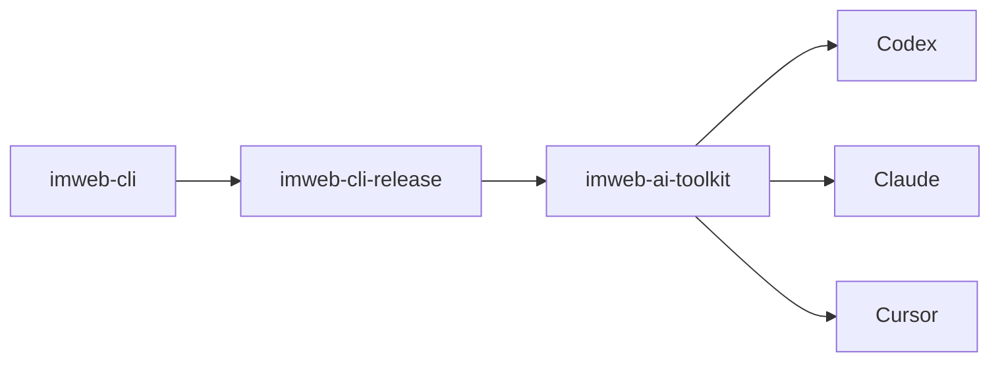

# imweb-ai-toolkit

[English](README.md) | [한국어](README.ko.md) | [日本語](README.ja.md)

`imweb-ai-toolkit` 将 `imweb` CLI 连接到受支持的 AI coding surface。此仓库提供 skill asset、surface metadata、示例，以及 install/bootstrap script。CLI 二进制文件和 release payload 来自公开的 `imweb-cli-release` 分发平面。



## 包含内容

- 用于 Codex、Claude、Cursor 和 MCP reference wiring 的 `plugin.json` 与 surface metadata
- `skills/imweb/`: `imweb` skill bundle 及其 bundle-local docs
- `install/`: 用于 CLI 和 skill setup 的 bootstrap/installer script
- `docs/`: 公开使用、集成和 support matrix 文档
- `examples/`: sample workflow 和 fixture

## 安装

对受支持的 surface 使用 bootstrap script。

```bash
./install/bootstrap-imweb.sh --tool codex --scope user
./install/bootstrap-imweb.sh --tool claude --scope user
```

PowerShell:

```powershell
./install/bootstrap-imweb.ps1 -Tool codex -Scope user
./install/bootstrap-imweb.ps1 -Tool claude -Scope user
```

Installer 默认使用公开的 `imweb-cli-release` stable channel。如需本地或固定版本测试，请按 [docs/skill-installation-and-usage.md](docs/skill-installation-and-usage.md) 说明传入 release manifest file。

## 从这里开始

1. [docs/skill-installation-and-usage.md](docs/skill-installation-and-usage.md)
2. [docs/cli-toolkit-integration.md](docs/cli-toolkit-integration.md)
3. [docs/surface-support-matrix.md](docs/surface-support-matrix.md)
4. [skills/imweb/SKILL.md](skills/imweb/SKILL.md)

## 支持范围

Codex 和 Claude 是 automated bootstrap 的主要支持 surface。Cursor 和 Claude Cowork 被记录为有限/手动连接 surface。权威 support detail 请参见 [docs/surface-support-matrix.md](docs/surface-support-matrix.md)。

## 许可证

此仓库中的 toolkit asset 根据 [Apache-2.0](LICENSE) 授权。
Imweb 商标和 brand asset 不包含在 Apache-2.0 授权中；请参见 [TRADEMARKS.md](TRADEMARKS.md)。
