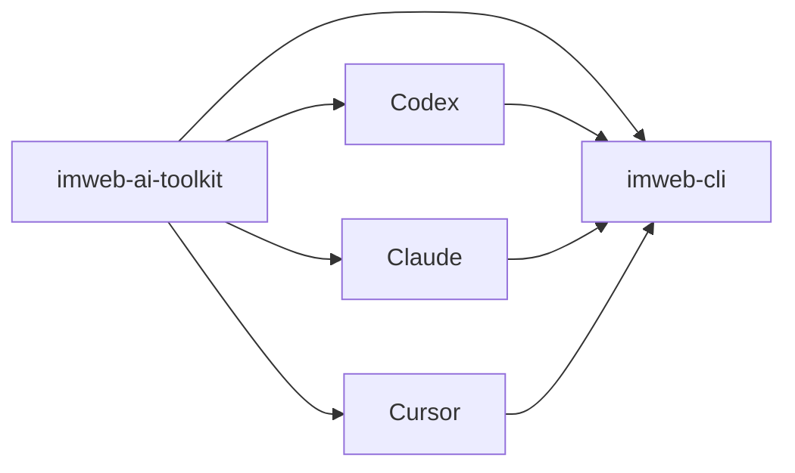

# imweb-ai-toolkit

[English](README.md) | [한국어](README.ko.md) | [日本語](README.ja.md)

`imweb-ai-toolkit` 会安装 `imweb` CLI，并将其连接到受支持的 AI coding tool。此仓库提供 skill asset、surface metadata、示例和 bootstrap script，让用户无需了解 CLI 背后的分发结构即可开始使用。



## 包含内容

- 用于 Codex、Claude、Cursor 和 MCP reference wiring 的 `plugin.json`、marketplace metadata 与 surface metadata
- `skills/imweb/`: `imweb` skill bundle 及其 bundle-local docs
- `install/`: 用于 CLI、skill 和 plugin setup 的 bootstrap/installer script
- `docs/`: 公开使用、集成和 support matrix 文档
- `examples/`: sample workflow 和 fixture

## 安装

对受支持的 surface 使用 bootstrap script。

```bash
./install/bootstrap-imweb.sh --tool codex --scope user
./install/bootstrap-imweb.sh --tool claude --scope user
```

PowerShell:

```powershell
./install/bootstrap-imweb.ps1 -Tool codex -Scope user
./install/bootstrap-imweb.ps1 -Tool claude -Scope user
```

Bootstrap script 会按需安装或更新 `imweb` CLI，然后为所选 tool 安装 `imweb` skill。高级本地设置或固定版本测试请参见 [docs/skill-installation-and-usage.md](docs/skill-installation-and-usage.md)。

Plugin-first setup 会注册或安装 toolkit plugin。

```bash
./install/install-plugins.sh --tool codex
./install/install-plugins.sh --tool claude --scope user
./install/install-plugins.sh --package imweb-ai-toolkit-plugin.zip
```

PowerShell:

```powershell
./install/install-plugins.ps1 -Tool codex
./install/install-plugins.ps1 -Tool claude -Scope user
./install/install-plugins.ps1 -Package imweb-ai-toolkit-plugin.zip
```

Codex 在注册 marketplace 后通过 Plugins UI 安装。Claude Code 可以从已注册的 marketplace 直接安装。Claude Desktop Cowork 可以上传生成的 plugin zip，或使用组织 marketplace。

## 从这里开始

1. [docs/skill-installation-and-usage.md](docs/skill-installation-and-usage.md)
2. [docs/cli-toolkit-integration.md](docs/cli-toolkit-integration.md)
3. [docs/surface-support-matrix.md](docs/surface-support-matrix.md)
4. [skills/imweb/SKILL.md](skills/imweb/SKILL.md)

## 支持范围

Codex App/CLI、Claude Code 和 Claude Desktop Cowork 是主要支持的 plugin surface。Cursor 被记录为有限/手动连接 surface。权威 support detail 请参见 [docs/surface-support-matrix.md](docs/surface-support-matrix.md)。

## 许可证

此仓库中的 toolkit asset 根据 [Apache-2.0](LICENSE) 授权。
Imweb 商标和 brand asset 不包含在 Apache-2.0 授权中；请参见 [TRADEMARKS.md](TRADEMARKS.md)。
